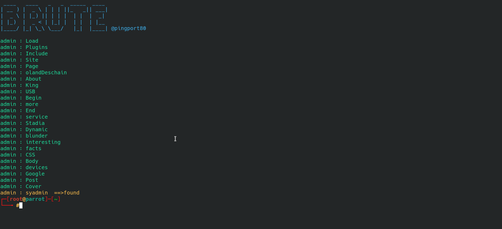

# [CVE-2019-17240](https://www.cvedetails.com/cve/CVE-2019-17240/) Exploit
**Versions prior to and including 3.9.2 of the Bludit CMS are vulnerable to a bypass of the anti-brute force mechanism that is in place to block users that have attempted to incorrectly login 10 times or more.**

The vulnerability was discovered by [Rastating](https://rastating.github.io/bludit-brute-force-mitigation-bypass/ "rastating.github.io").   

Submitting a login request with an X-Forwarded-For header value of a changing string(spoofed string) was processed successfully, and the failed login attempt was logged against the spoofed string.

The above script uses that vulnerablity to by bypass anit-brute mechanism.

There are csrf tokens in the body of the login page so before every time it does a post request with credentials it needs to fetch the csrf token from the source of last reponse.

One way of doing it is to make a get request, fetch csrf token and make a post request with credentials and fetched token and repeat until you find the password and this is what i saw in most of the scripts.

The other way is to fetch the csrf token from the response of last post request, so only for the first time you need to do a get request.

**The second one is much faster compared to the first one, and a little more efficiency effects a lot when it comes to bruteforce attacks where you need to do many requests.**

**I tried both the ways and was able to test 63 words in 1 minute by the second way and just 19 words by the first way.**

## Usage
    python3 brute.py -u [url] -user [username] -w [pathToWordlist] [-t [threads to use]]
## Example
    python3 brute.py -u https://192.168.10.13/ -user admin -w sysadmin -t 30

# SCREENSHOT

